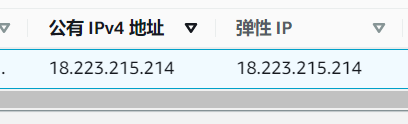
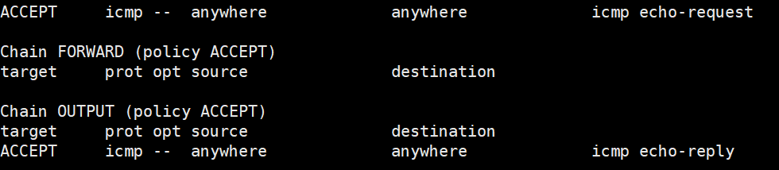

# PING-Web-Server

PING通web服务器的条件

 

有时我们用AWS、腾讯云或阿里云搭建了一个web服务器，这是如果想要ping通我们的服务器，需要满足一些条件。

### 1.首先要具备公网IP
确保你的服务器有一个公网IP，如果没有，一般可以申请一个`弹性IP`，如图： 

### 2.允许ICMP流量入站
在服务器的安全组中添加允许所有ICMP协议的流量入站的安全组，如图： 

### 3.更改服务器防火墙配置
注意在`Ubuntu`环境下，安装了防火墙之后，是没有自带的防火墙配置文件的，所以不能用`vim /etc/sysconfig/iptables`来更改配置，因为这个文件不存在。

我们需要自己创建一个配置文件： 
`sudo vim /etc/iptables.rules` 
在其中写入内容：

*filter 
:INPUT DROP [0:0] 
:syn-flood - [0:0] 
-A INPUT -i lo -j ACCEPT 
-A INPUT -m state --state RELATED,ESTABLISHED -j ACCEPT 
-A INPUT -p tcp -m state --state NEW -m tcp --dport 22 -j ACCEPT 
-A INPUT -p tcp -m state --state NEW -m tcp --dport 80 -j ACCEPT 
-A INPUT -p tcp -m state --state NEW -m tcp --dport 443 -j ACCEPT 
-A INPUT -p icmp -m limit --limit 100/sec --limit-burst 100 -j ACCEPT 
-A INPUT -p icmp -m limit --limit 1/s --limit-burst 10 -j ACCEPT 
-A INPUT -p tcp -m tcp --tcp-flags FIN,SYN,RST,ACK SYN -j syn-flood 
-A INPUT -j REJECT --reject-with icmp-host-prohibited 
-A syn-flood -p tcp -m limit --limit 3/sec --limit-burst 6 -j RETURN 
-A syn-flood -j REJECT --reject-with icmp-port-unreachable 
-A INPUT -p icmp --icmp-type echo-request -j ACCEPT 
-A OUTPUT -p icmp --icmp-type echo-reply -j ACCEPT 
COMMIT

保存退出。

以上规则中，上面的若干条是允许几个常规端口(如22,80)的`TCP`流量进入服务器，倒数的2，3条则是允许ICMP流量入站，这是ping通的关键！

由于配置文件是我们自己写的，所以防火墙并不知道去哪里导入这些配置，我们要告诉防火墙导入这些新的配置： 
`iptables-restore < /etc/iptables.rules`

最后我们使得以上配置在开机时自动生效： 
`sudo vim /etc/network/if-pre-up.d/iptables`

在其中写入： 
`#!/bin/bash` 
`iptables-restore < /etc/iptables.rules` 
保存退出。 
赋予它执行权限： 
`sudo chmod +x /etc/network/if-pre-up.d/iptables`

最后查看防火墙状态： 
`sudo iptables -L` 
其中包含如图所示的部分就说明配置成功: 

